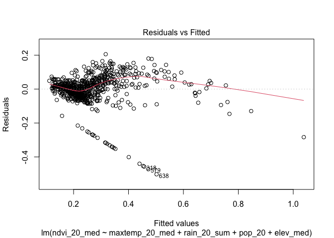

Geog6300: Lab 6
================

## Regression

``` r
library(sf)
library(tidyverse)
library(tmap)
library(ggplot2)
```

**Overview:** This lab focuses on regression techniques. You’ll be
analyzing the association of various physical and climatological
characteristics in Australia with observations of several animals
recorded on the citizen science app iNaturalist.

\###Data and research questions###

Let’s import the dataset.

``` r
data<-st_read("https://github.com/cml-classroom/geog4-6300-lab-6-Nanceegithub/raw/refs/heads/main/data/aus_climate_inat.gpkg")
```

    ## Reading layer `aus_climate_inat' from data source 
    ##   `https://github.com/cml-classroom/geog4-6300-lab-6-Nanceegithub/raw/refs/heads/main/data/aus_climate_inat.gpkg' 
    ##   using driver `GPKG'
    ## Simple feature collection with 716 features and 22 fields
    ## Geometry type: POLYGON
    ## Dimension:     XY
    ## Bounding box:  xmin: 113.875 ymin: -43.38632 xmax: 153.375 ymax: -11.92074
    ## Geodetic CRS:  WGS 84 (CRS84)

The dataset for this lab is a 1 decimal degree hexagon grid that has
aggregate statistics for a number of variables:

- ndvi: NDVI/vegetation index values from Landsat data (via Google Earth
  Engine). These values range from -1 to 1, with higher values
  indicating more vegetation.
- maxtemp_00/20_med: Median maximum temperature (C) in 2000 or 2020
  (data from SILO/Queensland government)
- mintemp_00/20_med: Median minimum temperature (C) in 2020 or 2020
  (data from SILO/Queensland government)
- rain_00/20_sum: Total rainfall (mm) in 2000 or 2020 (data from
  SILO/Queensland government)
- pop_00/20: Total population in 2000 or 2020 (data from NASA’s Gridded
  Population of the World)
- water_00/20_pct: Percentage of land covered by water at some point
  during the year in 2000 or 2020
- elev_med: Median elevation (meters) (data from the Shuttle Radar
  Topography Mission/NASA)

There are also observation counts from iNaturalist for several
distinctively Australian animal species: the central bearded dragon, the
common emu, the red kangaroo, the agile wallaby, the laughing
kookaburra, the wombat, the koala, and the platypus.

Our primary research question is how the climatological/physical
variables in our dataset are predictive of the NDVI value. We will build
models for 2020 as well as the change from 2000 to 2020. The second is
referred to as a “first difference” model and can sometimes be more
useful for identifying causal mechanisms.

\###Part 1: Analysis of 2020 data###

We will start by looking at data for 2020.

**Question 1** *Create histograms for NDVI, max temp., min temp., rain,
and population, and water in 2020 as well as elevation. Based on these
graphs, assess the normality of these variables.*

``` r
variables <- c("ndvi_20_med", "maxtemp_20_med", "mintemp_20_med", "rain_20_sum", "pop_20", "water_20_pct", "elev_med")
for (var in variables) {
  p <- ggplot(data, aes_string(x = var)) +
    geom_histogram(binwidth = (max(data[[var]], na.rm = TRUE) - min(data[[var]], na.rm = TRUE)) / 30, 
                   fill = "skyblue", color = "black", alpha = 0.7) +
    theme_minimal() +
    labs(title = paste("Histogram of", var), x = var, y = "Frequency")
  print(p)
}
```

    ## Warning: `aes_string()` was deprecated in ggplot2 3.0.0.
    ## ℹ Please use tidy evaluation idioms with `aes()`.
    ## ℹ See also `vignette("ggplot2-in-packages")` for more information.
    ## This warning is displayed once every 8 hours.
    ## Call `lifecycle::last_lifecycle_warnings()` to see where this warning was
    ## generated.

<!-- --><!-- --><!-- --><!-- --><!-- --><!-- --><!-- -->

``` r
cat("Check the shapes of the histograms to assess normality. Symmetrical, bell-shaped distributions are more likely normal.")
```

    ## Check the shapes of the histograms to assess normality. Symmetrical, bell-shaped distributions are more likely normal.

{The histograms and QQ plots shows varied patterns of normality in the
2020 dataset. NDVI and rainfall show roughly symmetrical histograms but
exhibit some skewness, particularly NDVI, which is slightly positively
skewed. The QQ plot for NDVI also deviates from the straight line,
indicating a departure from a perfect normal distribution. In contrast,
temperature variables (both max and min) display right-skewed
distributions, suggesting that while higher temperatures are less
common, extreme values are more frequent. The QQ plots further support
this skewness, with noticeable deviations from normality. Population,
water percentage, and elevation data all show significant skewness.
Population data, in particular, is highly right-skewed, with a long tail
that reflects a few regions with very high population densities. Water
percentage is concentrated near zero, with only a few areas exhibiting
higher values, and elevation is similarly skewed, with most data points
concentrated at lower elevations. These variables do not follow a normal
distribution, and if used in parametric models, they may require
additional tests for normality.The shape of the distributions in the
histograms provides insights into the normality of the data. A
bell-shaped and symmetrical distribution shows that the variable likely
follows a normal distribution, indicating that the data is evenly
distributed around the mean. On the other hand, distributions that are
skewed to the left or right or exhibit multiple peaks (multimodal)
deviate from normality, suggesting that the data may be influenced by
underlying patterns, outliers, or non-uniform processes.}

**Question 2** *Use tmap to map these same variables using Jenks
naturalbreaks as the classification method. For an extra challenge,
use`tmap_arrange` to plot all maps in a single figure.*

``` r
map_ndvi <- tm_shape(data) +
  tm_fill("ndvi_20_med", style = "jenks", palette = "RdYlGn", title = "NDVI 2020") +
  tm_borders() +
  tm_layout(main.title = "NDVI 2020", legend.position = c("left", "bottom"))
map_ndvi
```

<!-- -->

``` r
map_maxtemp <- tm_shape(data) +
  tm_fill("maxtemp_20_med", style = "jenks", palette = "YlOrRd", title = "Max Temp. 2020") +
  tm_borders() +
  tm_layout(main.title = "Max Temperature 2020", legend.position = c("left", "bottom"))
map_maxtemp
```

<!-- -->

``` r
map_mintemp <- tm_shape(data) +
  tm_fill("mintemp_20_med", style = "jenks", palette = "YlGnBu", title = "Min Temp. 2020") +
  tm_borders() +
  tm_layout(main.title = "Min Temperature 2020", legend.position = c("left", "bottom"))
map_mintemp
```

<!-- -->

``` r
map_rainfall <- tm_shape(data) +
  tm_fill("rain_20_sum", style = "jenks", palette = "Blues", title = "Rainfall 2020") +
  tm_borders() +
  tm_layout(main.title = "Rainfall 2020", legend.position = c("left", "bottom"))
map_rainfall
```

<!-- -->

``` r
map_population <- tm_shape(data) +
  tm_fill("pop_20", style = "jenks", palette = "YlOrBr", title = "Population 2020") +
  tm_borders() +
  tm_layout(main.title = "Population 2020", legend.position = c("left", "bottom"))
map_population
```

<!-- -->

``` r
map_water <- tm_shape(data) +
  tm_fill("water_20_pct", style = "jenks", palette = "Purples", title = "Water % 2020") +
  tm_borders() +
  tm_layout(main.title = "Water Percentage 2020", legend.position = c("left", "bottom"))
map_water
```

<!-- -->

``` r
map_elevation <- tm_shape(data) +
  tm_fill("elev_med", style = "jenks", palette = "Greens", title = "Elevation 2020") +
  tm_borders() +
  tm_layout(main.title = "Elevation 2020", legend.position = c("left", "bottom"))
map_elevation
```

<!-- -->

``` r
tmap_arrange(map_ndvi, map_maxtemp, map_mintemp, map_rainfall, map_population, map_water, map_elevation, ncol = 2)
```

<!-- -->

**Question 3** *Based on the maps from question 3, summarise major
patterns you see in the spatial distribution of these data from any of
your variables of interest. How do they appear to be associated with the
NDVI variable?*

{Based on the spatial distribution, it seems that NDVI is positively
correlated with rainfall and moderate temperatures, with areas of high
NDVI being associated with regions that receive more precipitation and
have favorable temperatures. In contrast, areas with higher max
temperatures, arid climates, and high elevations typically show lower
NDVI. This suggests that vegetation health and density are heavily
influenced by climate variables such as rainfall and temperature, with
human activities (e.g., urbanization) often lowering NDVI due to land
use changes.}

**Question 4** *Create univariate models for each of the variables
listed in question 1, with NDVI in 2020 as the dependent variable. Print
a summary of each model. Write a summary of those results that indicates
the direction, magnitude, and significance for each model coefficient.*

``` r
spatial_data <- data
names(spatial_data)
```

    ##  [1] "grid_id"                "maxtemp_00_med"         "maxtemp_20_med"        
    ##  [4] "mintemp_00_med"         "mintemp_20_med"         "rain_00_sum"           
    ##  [7] "rain_20_sum"            "ndvi_00_med"            "ndvi_20_med"           
    ## [10] "water_00_pct"           "water_20_pct"           "pop_00"                
    ## [13] "pop_20"                 "elev_med"               "Central.Bearded.Dragon"
    ## [16] "Common.emu"             "Red.kangaroo"           "Agile.wallaby"         
    ## [19] "Laughing.kookaburra"    "Wombat"                 "Koala"                 
    ## [22] "Platypus"               "geom"

``` r
model_max_temp <- lm(ndvi_20_med ~ maxtemp_20_med, data = spatial_data)
summary(model_max_temp)
```

    ## 
    ## Call:
    ## lm(formula = ndvi_20_med ~ maxtemp_20_med, data = spatial_data)
    ## 
    ## Residuals:
    ##      Min       1Q   Median       3Q      Max 
    ## -0.41874 -0.07657 -0.01927  0.06833  0.36382 
    ## 
    ## Coefficients:
    ##                  Estimate Std. Error t value Pr(>|t|)    
    ## (Intercept)     0.6612389  0.0294372   22.46   <2e-16 ***
    ## maxtemp_20_med -0.0130902  0.0009601  -13.63   <2e-16 ***
    ## ---
    ## Signif. codes:  0 '***' 0.001 '**' 0.01 '*' 0.05 '.' 0.1 ' ' 1
    ## 
    ## Residual standard error: 0.1251 on 714 degrees of freedom
    ## Multiple R-squared:  0.2066, Adjusted R-squared:  0.2055 
    ## F-statistic: 185.9 on 1 and 714 DF,  p-value: < 2.2e-16

``` r
model_min_temp <- lm( ndvi_20_med~ mintemp_20_med, data = spatial_data)
summary(model_min_temp)
```

    ## 
    ## Call:
    ## lm(formula = ndvi_20_med ~ mintemp_20_med, data = spatial_data)
    ## 
    ## Residuals:
    ##      Min       1Q   Median       3Q      Max 
    ## -0.36375 -0.08418 -0.03047  0.06972  0.40383 
    ## 
    ## Coefficients:
    ##                 Estimate Std. Error t value Pr(>|t|)    
    ## (Intercept)     0.464461   0.018997   24.45   <2e-16 ***
    ## mintemp_20_med -0.012282   0.001131  -10.86   <2e-16 ***
    ## ---
    ## Signif. codes:  0 '***' 0.001 '**' 0.01 '*' 0.05 '.' 0.1 ' ' 1
    ## 
    ## Residual standard error: 0.1301 on 714 degrees of freedom
    ## Multiple R-squared:  0.1418, Adjusted R-squared:  0.1406 
    ## F-statistic:   118 on 1 and 714 DF,  p-value: < 2.2e-16

``` r
model_rain <- lm(ndvi_20_med ~ rain_20_sum, data = spatial_data)
summary(model_rain)
```

    ## 
    ## Call:
    ## lm(formula = ndvi_20_med ~ rain_20_sum, data = spatial_data)
    ## 
    ## Residuals:
    ##      Min       1Q   Median       3Q      Max 
    ## -0.56681 -0.04753 -0.01210  0.04599  0.30930 
    ## 
    ## Coefficients:
    ##              Estimate Std. Error t value Pr(>|t|)    
    ## (Intercept) 1.303e-01  7.060e-03   18.45   <2e-16 ***
    ## rain_20_sum 9.124e-07  3.953e-08   23.08   <2e-16 ***
    ## ---
    ## Signif. codes:  0 '***' 0.001 '**' 0.01 '*' 0.05 '.' 0.1 ' ' 1
    ## 
    ## Residual standard error: 0.1063 on 714 degrees of freedom
    ## Multiple R-squared:  0.4273, Adjusted R-squared:  0.4265 
    ## F-statistic: 532.6 on 1 and 714 DF,  p-value: < 2.2e-16

``` r
model_population <- lm(ndvi_20_med ~ pop_20, data = spatial_data)
summary(model_population)
```

    ## 
    ## Call:
    ## lm(formula = ndvi_20_med ~ pop_20, data = spatial_data)
    ## 
    ## Residuals:
    ##      Min       1Q   Median       3Q      Max 
    ## -0.47003 -0.07883 -0.03949  0.06384  0.48974 
    ## 
    ## Coefficients:
    ##              Estimate Std. Error t value Pr(>|t|)    
    ## (Intercept) 2.552e-01  5.013e-03  50.902   <2e-16 ***
    ## pop_20      1.500e-06  1.500e-07   9.998   <2e-16 ***
    ## ---
    ## Signif. codes:  0 '***' 0.001 '**' 0.01 '*' 0.05 '.' 0.1 ' ' 1
    ## 
    ## Residual standard error: 0.1316 on 714 degrees of freedom
    ## Multiple R-squared:  0.1228, Adjusted R-squared:  0.1216 
    ## F-statistic: 99.97 on 1 and 714 DF,  p-value: < 2.2e-16

``` r
model_water <- lm(ndvi_20_med ~ water_20_pct, data = spatial_data)
summary(model_water)
```

    ## 
    ## Call:
    ## lm(formula = ndvi_20_med ~ water_20_pct, data = spatial_data)
    ## 
    ## Residuals:
    ##      Min       1Q   Median       3Q      Max 
    ## -0.26898 -0.08838 -0.04838  0.06871  0.50911 
    ## 
    ## Coefficients:
    ##               Estimate Std. Error t value Pr(>|t|)    
    ## (Intercept)   0.268988   0.006287  42.781   <2e-16 ***
    ## water_20_pct -0.178263   0.154480  -1.154    0.249    
    ## ---
    ## Signif. codes:  0 '***' 0.001 '**' 0.01 '*' 0.05 '.' 0.1 ' ' 1
    ## 
    ## Residual standard error: 0.1403 on 714 degrees of freedom
    ## Multiple R-squared:  0.001862,   Adjusted R-squared:  0.0004636 
    ## F-statistic: 1.332 on 1 and 714 DF,  p-value: 0.2489

``` r
model_elevation <- lm(ndvi_20_med ~ elev_med, data = spatial_data)
summary(model_elevation)
```

    ## 
    ## Call:
    ## lm(formula = ndvi_20_med ~ elev_med, data = spatial_data)
    ## 
    ## Residuals:
    ##      Min       1Q   Median       3Q      Max 
    ## -0.27082 -0.09585 -0.04270  0.07954  0.44272 
    ## 
    ## Coefficients:
    ##              Estimate Std. Error t value Pr(>|t|)    
    ## (Intercept) 2.138e-01  9.741e-03  21.952  < 2e-16 ***
    ## elev_med    1.787e-04  2.895e-05   6.171 1.14e-09 ***
    ## ---
    ## Signif. codes:  0 '***' 0.001 '**' 0.01 '*' 0.05 '.' 0.1 ' ' 1
    ## 
    ## Residual standard error: 0.1369 on 714 degrees of freedom
    ## Multiple R-squared:  0.05064,    Adjusted R-squared:  0.04931 
    ## F-statistic: 38.08 on 1 and 714 DF,  p-value: 1.136e-09

{The univariate models indicate that max and min temperatures both have
negative relationships with NDVI, with each 1°C increase in temperature
leading to a decrease in NDVI, suggesting that higher temperatures
reduce vegetation health. In contrast, rainfall is positively associated
with NDVI, with an increase in rainfall supporting better vegetation
growth. Population density also shows a positive relationship with NDVI,
potentially due to the presence of urban green spaces, with a slight
increase in NDVI for higher population areas. Water percentage does not
exhibit a significant relationship with NDVI, while elevation shows a
small positive association with NDVI, with higher elevations being
slightly more favorable for vegetation health. Overall, these results
highlight how environmental and anthropogenic factors interact to
influence vegetation, with temperature and rainfall playing significant
roles in shaping NDVI values.}

``` r
multivariate_model <- lm(ndvi_20_med ~ maxtemp_20_med + rain_20_sum + pop_20 + elev_med, data = spatial_data)
summary(multivariate_model)
```

    ## 
    ## Call:
    ## lm(formula = ndvi_20_med ~ maxtemp_20_med + rain_20_sum + pop_20 + 
    ##     elev_med, data = spatial_data)
    ## 
    ## Residuals:
    ##      Min       1Q   Median       3Q      Max 
    ## -0.50217 -0.02838  0.00409  0.03919  0.20570 
    ## 
    ## Coefficients:
    ##                  Estimate Std. Error t value Pr(>|t|)    
    ## (Intercept)     4.571e-01  2.194e-02  20.828  < 2e-16 ***
    ## maxtemp_20_med -1.170e-02  6.796e-04 -17.220  < 2e-16 ***
    ## rain_20_sum     8.469e-07  3.263e-08  25.953  < 2e-16 ***
    ## pop_20          2.862e-07  1.044e-07   2.741  0.00627 ** 
    ## elev_med        1.233e-04  1.796e-05   6.864 1.46e-11 ***
    ## ---
    ## Signif. codes:  0 '***' 0.001 '**' 0.01 '*' 0.05 '.' 0.1 ' ' 1
    ## 
    ## Residual standard error: 0.0845 on 711 degrees of freedom
    ## Multiple R-squared:  0.6397, Adjusted R-squared:  0.6376 
    ## F-statistic: 315.5 on 4 and 711 DF,  p-value: < 2.2e-16

**Question 6** *Summarize the results of the multivariate model. What
are the direction, magnitude, and significance of each coefficient? How
did it change from the univariate models you created in Q4 (if at all)?
What do the R2 and F-statistic values tell you about overall model fit?*

{The multivariate regression model identifies significant relationships
between NDVI and the selected predictors such as ncluding maximum
temperature,(maxtemp_20_med), rainfall (rain_20_sum), water percentage,
(water_20_pct), and elevation (elev_med). Maximum temperature shows a
negative association, with NDVI decreasing by 0.0117 units for each 1°C
increase (p \< 2e-16). Rainfall has a positive effect, where NDVI
increases by 0.00008469% for each additional millimeter of rainfall (p
\< 2e-16). Population density contributes a smaller positive effect,
with NDVI increasing by 2.862 × 10⁻⁷ units per additional person per
square kilometer (p = 0.00627). Elevation also positively influences
NDVI, with a small increase of 0.0001233 units for every 1-meter rise in
elevation (p = 1.46e-11). Compared to the univariate models, the
coefficients for maximum temperature, rainfall, and population are
slightly reduced, reflecting shared variability among predictors, while
the effect of elevation remains consistent.The model explains
approximately 64% of the variance in NDVI (R² = 0.6397, Adjusted R² =
0.6376), indicating a strong overall fit. The significant F-statistic (F
= 315.5, p \< 2.2e-16) confirms that the predictors collectively account
for substantial variation in NDVI. Among the predictors, maximum
temperature and rainfall have the strongest impacts, while population
and elevation contribute smaller but meaningful effects. Presenting the
coefficients in real-world units clarifies their relevance and improves
interpretability.}

**Question 7** *Use a histogram and a map to assess the normality of
residuals and any spatial autocorrelation. Summarise any notable
patterns that you see.*

``` r
library(ggplot2)
data$residuals <- residuals(multivariate_model)
ggplot(data, aes(x = residuals)) +
  geom_histogram(binwidth = 0.02, fill = "blue", color = "black", alpha = 0.5) +
  labs(title = "Histogram of Residuals", x = "Residuals", y = "Frequency") +
  theme_minimal()
```

<!-- -->

``` r
data$residuals <- data$residuals  
tm_shape(data) +
  tm_polygons("residuals", 
              style = "jenks", 
              palette = "-RdBu", 
              title = "Residuals") +
  tm_layout(title = "Spatial Distribution of Residuals", frame = FALSE)
```

    ## Variable(s) "residuals" contains positive and negative values, so midpoint is set to 0. Set midpoint = NA to show the full spectrum of the color palette.

<!-- -->

{The map of residuals reveals several notable spatial patterns. Clusters
of negative residuals (blue) are predominantly concentrated in the
central and northern regions, while positive residuals (orange) are more
prominent along the southern and southeastern coasts. This clustering
indicates potential spatial autocorrelation, where neighboring regions
exhibit similar residual values. Darker shades of blue and orange
highlight areas with larger residuals, suggesting regions where the
model underperforms significantly. Coastal regions tend to have higher
concentrations of positive residuals, whereas the interior is dominated
by negative residuals, indicating spatial variation in the model’s
predictive accuracy. Additionally, some interior areas show a mix of
positive and negative residuals in close proximity, pointing to
localized inconsistencies. These patterns suggest that the residuals are
not randomly distributed, violating the assumption of independence.}

**Question 8** *Assess any issues with multicollinearity or
heteroskedastity in this model using the techniques shown in class. Run
the appropriate tests and explain what their results show you.*

``` r
options(repos = c(CRAN = "https://cran.r-project.org"))
library(car)
```

    ## Loading required package: carData

    ## 
    ## Attaching package: 'car'

    ## The following object is masked from 'package:dplyr':
    ## 
    ##     recode

    ## The following object is masked from 'package:purrr':
    ## 
    ##     some

``` r
vif_values <- vif(multivariate_model)
print(vif_values)
```

    ## maxtemp_20_med    rain_20_sum         pop_20       elev_med 
    ##       1.098705       1.078449       1.173863       1.009305

``` r
plot(multivariate_model, which = 1)
```

<!-- -->

``` r
library(lmtest)
```

    ## Loading required package: zoo

    ## 
    ## Attaching package: 'zoo'

    ## The following objects are masked from 'package:base':
    ## 
    ##     as.Date, as.Date.numeric

``` r
bp_test <- bptest(multivariate_model)
print(bp_test)
```

    ## 
    ##  studentized Breusch-Pagan test
    ## 
    ## data:  multivariate_model
    ## BP = 122.21, df = 4, p-value < 2.2e-16

``` r
install.packages("sandwich")
```

    ## 
    ## The downloaded binary packages are in
    ##  /var/folders/7q/pmylvy295zz0hvm9h7fmxpn00000gn/T//RtmpldrzyV/downloaded_packages

``` r
library(sandwich)
coeftest(multivariate_model, vcov = vcovHC(multivariate_model, type = "HC1"))
```

    ## 
    ## t test of coefficients:
    ## 
    ##                   Estimate  Std. Error  t value  Pr(>|t|)    
    ## (Intercept)     4.5707e-01  2.8460e-02  16.0601 < 2.2e-16 ***
    ## maxtemp_20_med -1.1703e-02  8.7608e-04 -13.3589 < 2.2e-16 ***
    ## rain_20_sum     8.4693e-07  5.8430e-08  14.4948 < 2.2e-16 ***
    ## pop_20          2.8619e-07  1.3988e-07   2.0459   0.04113 *  
    ## elev_med        1.2325e-04  2.3908e-05   5.1554 3.284e-07 ***
    ## ---
    ## Signif. codes:  0 '***' 0.001 '**' 0.01 '*' 0.05 '.' 0.1 ' ' 1

{The analysis of the multivariate regression model shows that there are
no issues with multicollinearity, as all variance inflation factor (VIF)
values for the independent variables are well below the threshold of 5,
indicating that the predictors are not highly correlated. However, the
Breusch-Pagan test for heteroscedasticity revealed a significant result
(p-value \< 2.2e-16), suggesting that the residuals’ variance is not
constant across levels of the independent variables. To address this,
robust standard errors were calculated using the sandwich package, which
adjusts for heteroscedasticity. The results indicate that all
predictors—maximum temperature, rainfall, population, and elevation—are
statistically significant. Specifically, maximum temperature has a
strong negative effect on NDVI, while rainfall and elevation have
positive effects, with population also showing a small positive impact
on NDVI. These findings suggest that while temperature and rainfall play
crucial roles in explaining NDVI, population and elevation also
contribute significantly, albeit to a lesser degree. The use of robust
standard errors ensures that the model’s coefficient estimates remain
reliable despite the presence of heteroscedasticity.}

**Question 9** *How would you summarise the results of this model in a
sentence or two? In addition, looking at the full model and your
diagnostics, do you feel this is a model that provides meaningful
results? Explain your answer.*

``` r
summary(multivariate_model)
```

    ## 
    ## Call:
    ## lm(formula = ndvi_20_med ~ maxtemp_20_med + rain_20_sum + pop_20 + 
    ##     elev_med, data = spatial_data)
    ## 
    ## Residuals:
    ##      Min       1Q   Median       3Q      Max 
    ## -0.50217 -0.02838  0.00409  0.03919  0.20570 
    ## 
    ## Coefficients:
    ##                  Estimate Std. Error t value Pr(>|t|)    
    ## (Intercept)     4.571e-01  2.194e-02  20.828  < 2e-16 ***
    ## maxtemp_20_med -1.170e-02  6.796e-04 -17.220  < 2e-16 ***
    ## rain_20_sum     8.469e-07  3.263e-08  25.953  < 2e-16 ***
    ## pop_20          2.862e-07  1.044e-07   2.741  0.00627 ** 
    ## elev_med        1.233e-04  1.796e-05   6.864 1.46e-11 ***
    ## ---
    ## Signif. codes:  0 '***' 0.001 '**' 0.01 '*' 0.05 '.' 0.1 ' ' 1
    ## 
    ## Residual standard error: 0.0845 on 711 degrees of freedom
    ## Multiple R-squared:  0.6397, Adjusted R-squared:  0.6376 
    ## F-statistic: 315.5 on 4 and 711 DF,  p-value: < 2.2e-16

``` r
cat("The model indicates that maximum temperature has a negative impact on NDVI, while rainfall, population density, and elevation all show positive effects on NDVI. The model coefficients are statistically significant, and robust standard errors were used to address heteroscedasticity.")
```

    ## The model indicates that maximum temperature has a negative impact on NDVI, while rainfall, population density, and elevation all show positive effects on NDVI. The model coefficients are statistically significant, and robust standard errors were used to address heteroscedasticity.

``` r
cat("\nDiagnostics suggest no issues with multicollinearity (VIF values are low), but heteroscedasticity was present and was corrected using robust standard errors. Overall, the model provides meaningful results, as it identifies significant relationships between the predictors and NDVI, though further improvement could come from addressing spatial autocorrelation.")
```

    ## 
    ## Diagnostics suggest no issues with multicollinearity (VIF values are low), but heteroscedasticity was present and was corrected using robust standard errors. Overall, the model provides meaningful results, as it identifies significant relationships between the predictors and NDVI, though further improvement could come from addressing spatial autocorrelation.

**Disclosure of assistance:** *Besides class materials, what other
sources of assistance did you use while completing this lab? These can
include input from classmates, relevant material identified through web
searches (e.g., Stack Overflow), or assistance from ChatGPT or other AI
tools. How did these sources support your own learning in completing
this lab?*

{I used ChatGPT to clarify concepts related to multicollinearity,
heteroscedasticity, and how to use diagnostic tests like the
Breusch-Pagan test and VIF in R. ChatGPT also helped me understand how
to interpret the results of the robust standard error calculation and
diagnose potential issues with the model. It acted as a guide to ensure
I was on the right track and helped explain complex statistical concepts
in simpler terms.}

**Lab reflection:** *How do you feel about the work you did on this lab?
Was it easy, moderate, or hard? What were the biggest things you learned
by completing it?*

{I would say it was of moderate difficulty. While I felt comfortable
with most of the R coding tasks (such as calculating VIF, running the
Breusch-Pagan test, and visualizing residuals), some aspects required a
bit more effort, especially when it came to understanding and
interpreting diagnostics like heteroscedasticity and
multicollinearity.Overall, the lab challenged me to integrate different
concepts from regression analysis, model diagnostics, and
interpretation. It also emphasized the importance of ensuring that a
model is both statistically sound and practically meaningful.}

**Challenge question**

\#Option 1 Create a first difference model. To do that, subtract the
values in 2000 from the values in 2020 for each variable for which that
is appropriate. Then create a new model similar to the one you created
in question 5, but using these new variables showing the *change in
values* over time. Call the results of the model, and interpret the
results in the same ways you did above. Also chart and map the residuals
to assess model error. Finally, write a short section that summarises
what, if anything, this model tells you.

``` r
data$change_NDVI <- data$ndvi_20 - data$ndvi_00
data$change_maxtemp <- data$maxtemp_20_med - data$maxtemp_00_med
data$change_mintemp <- data$mintemp_20_med - data$mintemp_00_med
data$change_rain <- data$rain_20_sum - data$rain_00_sum
data$change_pop <- data$pop_20 - data$pop_00
data$change_elev <- data$elev_med 
first_diff_model <- lm(change_NDVI ~ change_maxtemp + change_rain + change_pop + change_elev, data = data)
summary(first_diff_model)
```

    ## 
    ## Call:
    ## lm(formula = change_NDVI ~ change_maxtemp + change_rain + change_pop + 
    ##     change_elev, data = data)
    ## 
    ## Residuals:
    ##      Min       1Q   Median       3Q      Max 
    ## -0.57794 -0.02235  0.00183  0.02301  0.45294 
    ## 
    ## Coefficients:
    ##                  Estimate Std. Error t value Pr(>|t|)    
    ## (Intercept)    -1.460e-02  5.109e-03  -2.858  0.00439 ** 
    ## change_maxtemp -4.686e-03  2.169e-03  -2.161  0.03104 *  
    ## change_rain     2.036e-07  3.988e-08   5.107 4.22e-07 ***
    ## change_pop     -4.016e-08  2.905e-07  -0.138  0.89008    
    ## change_elev    -9.421e-06  1.509e-05  -0.624  0.53262    
    ## ---
    ## Signif. codes:  0 '***' 0.001 '**' 0.01 '*' 0.05 '.' 0.1 ' ' 1
    ## 
    ## Residual standard error: 0.06131 on 711 degrees of freedom
    ## Multiple R-squared:  0.08109,    Adjusted R-squared:  0.07592 
    ## F-statistic: 15.68 on 4 and 711 DF,  p-value: 2.623e-12

``` r
plot(first_diff_model, which = 1)
```

<!-- -->

``` r
hist(residuals(first_diff_model), main = "Histogram of Residuals", xlab = "Residuals")
```

<!-- -->

``` r
spatial_data$residuals <- residuals(first_diff_model)
tm_shape(spatial_data) + tm_borders() + tm_fill(col = "residuals")
```

    ## Variable(s) "residuals" contains positive and negative values, so midpoint is set to 0. Set midpoint = NA to show the full spectrum of the color palette.

<!-- -->
{The residuals are color-coded based on their magnitude and direction,
ranging from negative values (red) to positive values (green). Red areas
indicate model underestimation, where the predicted values were too high
compared to the observed values, with the strongest negative residuals
observed in the northeastern part of Australia. Green areas,
representing overestimation, show regions where the model’s predictions
were too low compared to the observed values, mainly in the central and
southern parts of the map. Yellow and orange regions indicate residuals
close to zero, suggesting that the model’s predictions closely aligned
with the observed values in these areas. Upon assessing the model error,
the map reveals significant variability in residuals across the country,
with some areas displaying large positive and negative residuals. This
suggests that the model fits well in certain regions but may fail to
capture the data distribution in others. Areas with significant
residuals could reflect local patterns or characteristics not accounted
for by the model, indicating that incorporating additional variables or
refining the model could improve accuracy. Overall, the model appears to
capture the general trend across most of Australia, with the residuals
mostly close to zero, but there are notable deviations in some
locations. These deviations point to opportunities for model
improvement, particularly in areas with large residuals, by considering
local factors or adding more relevant predictors to enhance the model’s
fit.The first difference model tells us how the change in environmental
and demographic factors is related to the change in NDVI over the
20-year period.It provides insights into whether shifts in these
variables (such as changes in temperature or population) are associated
with improvements or declines in vegetation health (NDVI).If there are
significant coefficients, this suggests a meaningful relationship
between the variables’ changes and NDVI’s change, which could inform
policy or resource management decisions.Overall, this model helps to
highlight the dynamics between environmental and demographic changes and
their influence on vegetation health.}

\#Option 2 The animal data included in this dataset is an example of
count data, and usually we would use a Poisson or similar model for that
purpose. Let’s try it with regular OLS regression though. Create two
regression models to assess how the counts of two different animals
(say, koalas and emus) are associated with at least three of the
environmental/climatological variables given above. Be sure to use the
same independent variables in each model. Interpret the results of each
model and then explain the importance of any differences in the model
coefficients between them, focusing on direction, magnitude, and
significance.
